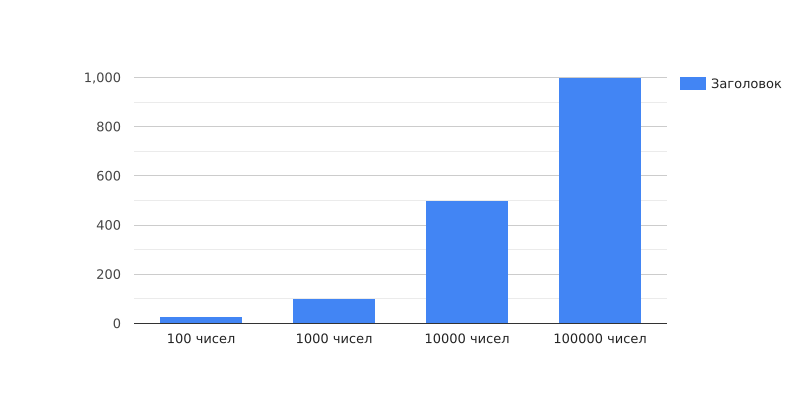
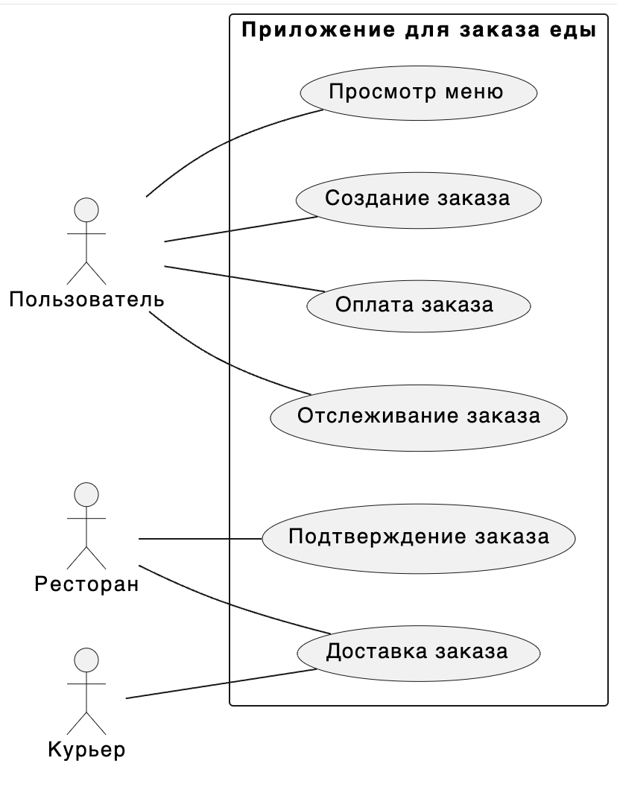
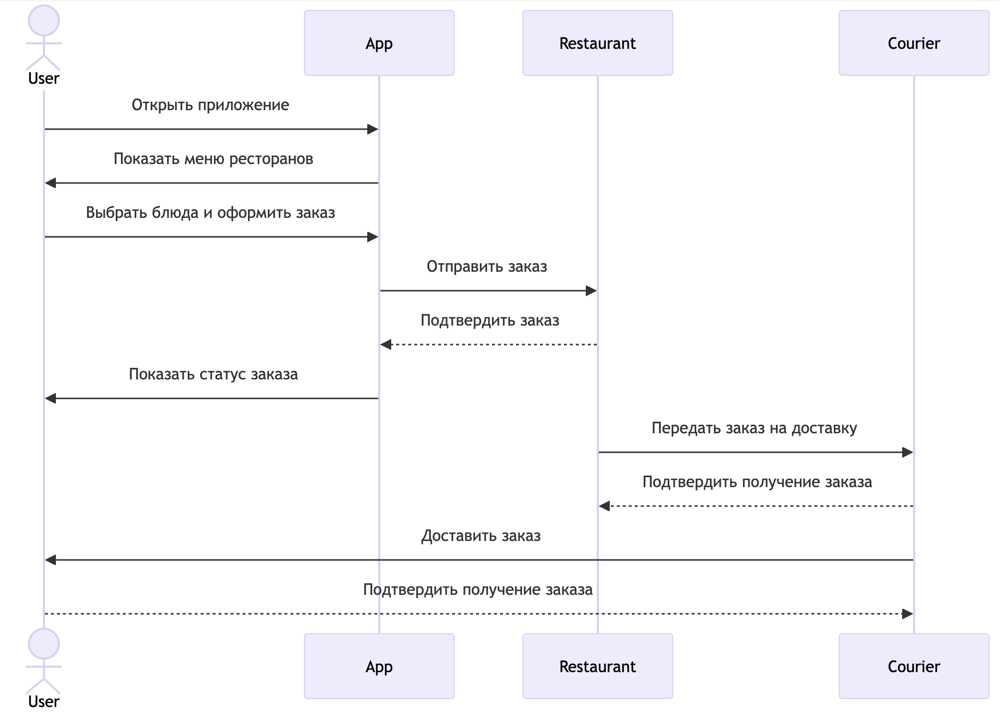
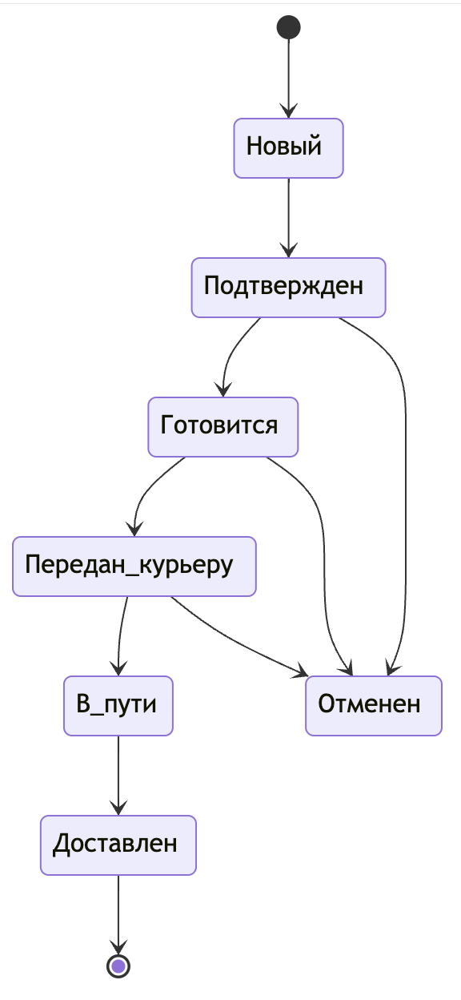
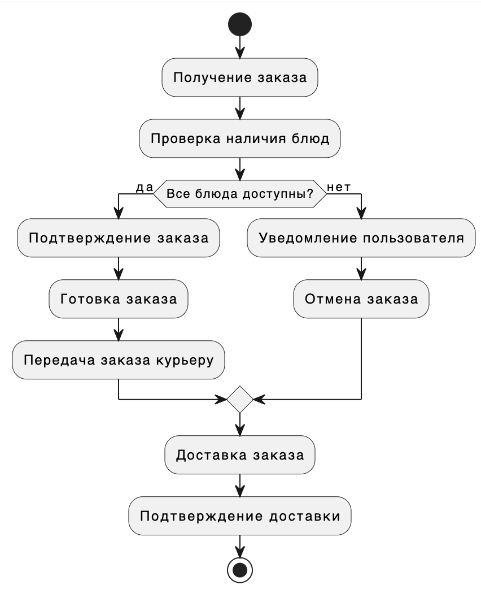
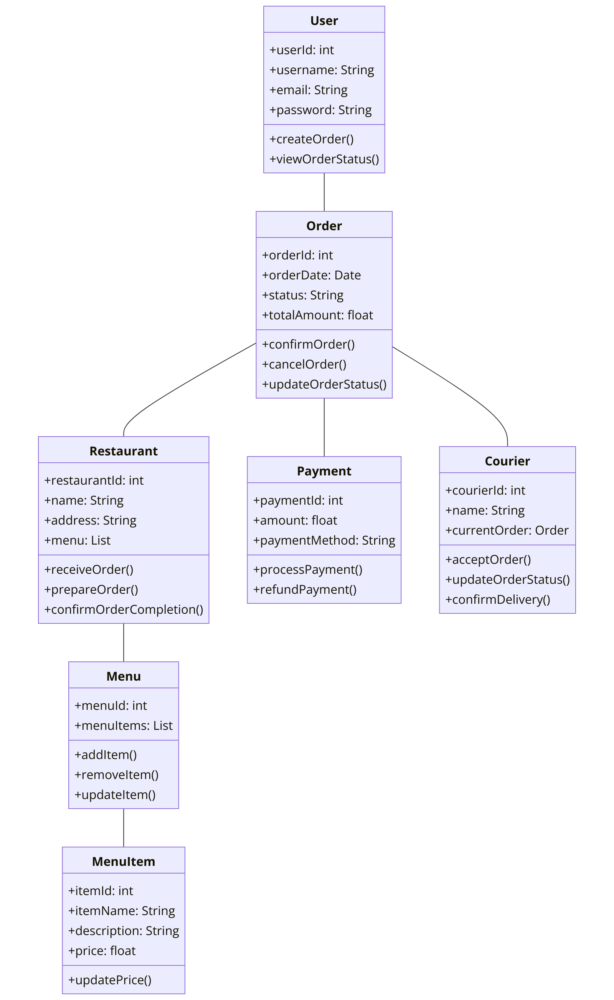

### Код скрипта ТЗ номер 1 

Ниже представлено обьяснение моего скрипта 


Этот Bash-скрипт предназначен для копирования всех файлов из одной директории (входной директории) в другую (выходную директорию), при этом предотвращая перезапись файлов с одинаковыми именами.
Скрипт проверяет, передано ли ровно два аргумента (имена входной и выходной директорий). Если нет, выводится сообщение о неправильном использовании скрипта, и скрипт завершает выполнение с ошибкой. С помощью команды find, скрипт ищет все файлы в директории, выводя результаты с разделителем, что позволяет корректно обрабатывать имена с пробелами и специальными символами. Цикл while считывает эти имена файлов для последующей обработки. Из полного пути файла извлекается только имя файла, и формируется путь к целевому файлу в выходной директории. Если файл с таким именем уже существует в выходной директории, к имени файла добавляется счетчик, чтобы избежать перезаписи.


### Для запуска 

```
sh tz1PostniiIurii233.sh <входная директория> <Выходная директория>
```

# Техническое Задание 2 

Во втором техническом задании мною написана простая Java программа которая читает список целых чисел из файла и выполняет с ними несколько математических операций.Ниже описан каждый метод программы:

_min: Находит минимальное число в списке.

_max: Находит максимальное число в списке.

_sum: Вычисляет сумму всех чисел в списке.

_mult: Вычисляет произведение всех чисел в списке. Особенность этого метода в том, что он начинает с 1 (а не с 0), чтобы корректно рассчитать произведение.

Эта программа полезна для быстрой обработки числовых данных из файла и может быть использована для статистического анализа или в качестве утилиты для обработки числовых данных.

## Здесь представлена зависимость времени от количетсва передаваемых чисел



# Тезническое задание 3

В данном задании я должен был с помощью диаграмм UML спроектировать приложение доставки еды, ниже будет представлена вся информация по данному заданию.

### Описание

Система заказа еды представляет собой приложение, которое позволяет пользователям заказывать еду из ресторанов, управлять своими заказами, отслеживать их статус и осуществлять оплату. Взаимодействие пользователей с системой включает следующие основные процессы: просмотр меню, создание заказа, оплата заказа, отслеживание статуса заказа и подтверждение доставки. В самом репозитрории прикреплён pdf файл с подробным описанием работы системы.

#### Диаграмма вариантов использования 

Основные элементы диаграммы:

	1.	Пользователи (Акторы):
	•	Пользователь: Основной пользователь приложения, который заказывает еду.
	•	Ресторан: Поставщик еды, который подтверждает заказы.
	•	Курьер: Лицо, доставляющее заказ пользователю.
	2.	Приложение для заказа еды: Основная система, в которой происходят все взаимодействия.
	3.	Варианты использования:
	•	Просмотр меню: Пользователь может просматривать доступное меню.
	•	Создание заказа: Пользователь может создать заказ из выбранных блюд.
	•	Оплата заказа: Пользователь может оплатить свой заказ.
	•	Отслеживание заказа: Пользователь может отслеживать статус своего заказа.
	•	Подтверждение заказа: Ресторан подтверждает поступивший заказ.
	•	Доставка заказа: Курьер доставляет заказ пользователю.

#### Диаграмма последовательности 

Основные элементы диаграммы:

	1.	Акторы:
	•	User (Пользователь): Основной пользователь приложения, который заказывает еду.
	•	App (Приложение): Программная система, через которую пользователь взаимодействует с рестораном и курьером.
	•	Restaurant (Ресторан): Заведение, которое принимает и готовит заказ.
	•	Courier (Курьер): Лицо, доставляющее заказ пользователю.

 #### Диаграмма состояний 
 
 Основные элементы диаграммы:

	1.	Состояния:
	•	Новый: Начальное состояние заказа после его создания пользователем.
	•	Подтвержден: Заказ подтвержден рестораном.
	•	Готовится: Заказ готовится в ресторане.
	•	Передан курьеру: Заказ передан курьеру для доставки.
	•	В пути: Курьер доставляет заказ.
	•	Доставлен: Заказ доставлен пользователю.
	•	Отменен: Заказ отменен.
	2.	Переходы между состояниями:
	•	Из состояния “Новый” в состояние “Подтвержден”: Когда ресторан подтверждает заказ.
	•	Из состояния “Подтвержден” в состояние “Готовится”: Когда ресторан начинает готовить заказ.
	•	Из состояния “Готовится” в состояние “Передан курьеру”: Когда заказ готов и передан курьеру.
	•	Из состояния “Передан курьеру” в состояние “В пути”: Когда курьер начинает доставку заказа.
	•	Из состояния “В пути” в состояние “Доставлен”: Когда курьер доставляет заказ пользователю.
	•	Из состояния “Подтвержден”, “Готовится” или “Передан курьеру” в состояние “Отменен”: Когда заказ отменяется на любом из этих этапов.

 #### Диаграмма деятельности 
 
 Основные элементы диаграммы:

	1.	Начало: Начальная точка процесса, обозначенная заполненным черным кругом.
	2.	Действия:
	•	Получение заказа: Приложение получает заказ от пользователя.
	•	Проверка наличия блюд: Проверка доступности всех заказанных блюд в ресторане.
	•	Подтверждение заказа: Подтверждение заказа рестораном, если все блюда доступны.
	•	Уведомление пользователя: Уведомление пользователя о недоступности некоторых блюд.
	•	Готовка заказа: Приготовление заказа рестораном.
	•	Передача заказа курьеру: Передача приготовленного заказа курьеру для доставки.
	•	Доставка заказа: Курьер доставляет заказ пользователю.
	•	Подтверждение доставки: Подтверждение доставки заказа пользователем.
	•	Отмена заказа: Отмена заказа, если некоторые блюда недоступны.
	3.	Решения (ветвления):
	•	Все блюда доступны?: Проверка доступности всех заказанных блюд. Ветвление на “да” (все блюда доступны) и “нет” (не все блюда доступны).
	4.	Конец: Конечная точка процесса, обозначенная кругом с черной заливкой.

 #### Диаграмма классов
 
 Основные классы:

	1.	User (Пользователь):
	•	Атрибуты:
	•	userId: int - уникальный идентификатор пользователя.
	•	username: String - имя пользователя.
	•	email: String - электронная почта пользователя.
	•	password: String - пароль пользователя.
	•	Методы:
	•	createOrder() - создать заказ.
	•	viewOrderStatus() - просмотреть статус заказа.
	2.	Order (Заказ):
	•	Атрибуты:
	•	orderId: int - уникальный идентификатор заказа.
	•	orderDate: Date - дата создания заказа.
	•	status: String - статус заказа.
	•	totalAmount: float - общая сумма заказа.
	•	Методы:
	•	confirmOrder() - подтвердить заказ.
	•	cancelOrder() - отменить заказ.
	•	updateOrderStatus() - обновить статус заказа.
	3.	Restaurant (Ресторан):
	•	Атрибуты:
	•	restaurantId: int - уникальный идентификатор ресторана.
	•	name: String - название ресторана.
	•	address: String - адрес ресторана.
	•	menu: List - меню ресторана.
	•	Методы:
	•	receiveOrder() - получить заказ.
	•	prepareOrder() - приготовить заказ.
	•	confirmOrderCompletion() - подтвердить выполнение заказа.
	4.	Payment (Оплата):
	•	Атрибуты:
	•	paymentId: int - уникальный идентификатор платежа.
	•	amount: float - сумма платежа.
	•	paymentMethod: String - способ оплаты.
	•	Методы:
	•	processPayment() - обработать платеж.
	•	refundPayment() - вернуть платеж.
	5.	Courier (Курьер):
	•	Атрибуты:
	•	courierId: int - уникальный идентификатор курьера.
	•	name: String - имя курьера.
	•	currentOrder: Order - текущий заказ, который доставляет курьер.
	•	Методы:
	•	acceptOrder() - принять заказ для доставки.
	•	updateOrderStatus() - обновить статус заказа.
	•	confirmDelivery() - подтвердить доставку заказа.
	6.	Menu (Меню):
	•	Атрибуты:
	•	menuId: int - уникальный идентификатор меню.
	•	menuItems: List - список блюд в меню.
	•	Методы:
	•	addItem() - добавить блюдо в меню.
	•	removeItem() - удалить блюдо из меню.
	•	updateItem() - обновить блюдо в меню.
	7.	MenuItem (Блюдо):
	•	Атрибуты:
	•	itemId: int - уникальный идентификатор блюда.
	•	itemName: String - название блюда.
	•	description: String - описание блюда.
	•	price: float - цена блюда.
	•	Методы:
	•	updatePrice() - обновить цену блюда.
 
 


